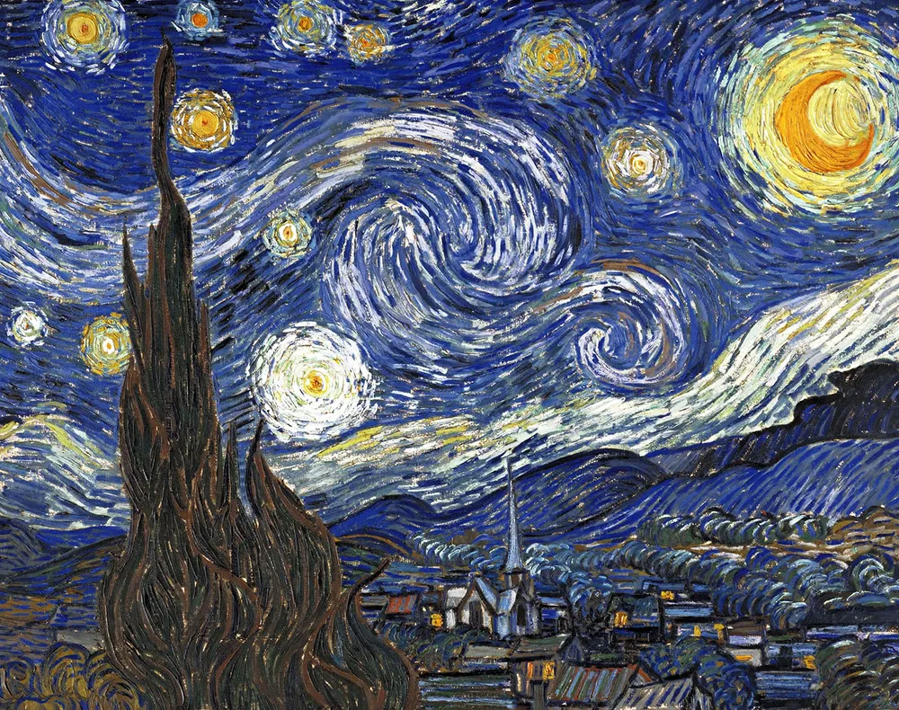
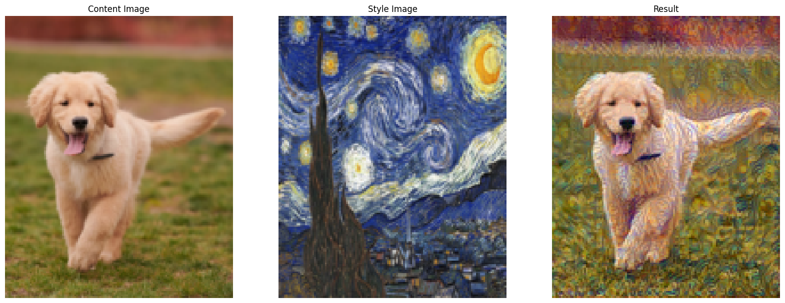

# 🎨 VGGly – Neural Style Transfer with VGG19

VGGly is a **Neural Style Transfer** project built using **PyTorch** and a pre-trained **VGG19** model. It blends the *content* of one image with the *style* of another to generate artistic outputs.

---

## 📌 Overview

This project implements the classic **Neural Style Transfer** technique:

- Extracts **content features** from a content image  
- Extracts **style features (Gram matrices)** from a style image  
- Optimizes a target image to minimize both:
  - Content loss
  - Style loss  

---

## 🖼️ Example

| Content | Style | Output |
|--------|-------|--------|
|  |  |  |

---

## ⚙️ Tech Stack

- Python  
- PyTorch  
- Torchvision  
- PIL  
- Matplotlib  

---

## 🧠 Model Details

- Uses **VGG19 pretrained on ImageNet**
- Feature extraction layers:

```
conv1_1
conv2_1
conv3_1
conv4_1
conv4_2  ← Content Layer
conv5_1
```

- Style is captured using **Gram Matrices**

---

## 📉 Loss Functions

### Content Loss
Mean Squared Error between:
```
Target Features vs Content Features
```

### Style Loss
Mean Squared Error between:
```
Gram(Target Features) vs Gram(Style Features)
```

### Total Loss
```
Total Loss = Content Loss + (Style Weight × Style Loss)
```

---

## 🚀 How to Run

### 1. Clone the repo
```
git clone https://github.com/your-username/vggly.git
cd vggly
```

### 2. Install dependencies
```
pip install torch torchvision matplotlib pillow
```

### 3. Run the notebook
Open the `.ipynb` file and execute all cells.

---

## 📂 Project Structure

```
vggly/
│
├── vggly.ipynb        # Main notebook
├── content.png        # Content image
├── style.png          # Style image
├── vggly_result.png   # Output image
└── README.md
```

---

## ⚡ Hyperparameters

| Parameter        | Value   |
|-----------------|--------|
| Learning Rate   | 0.003  |
| Iterations      | 300    |
| Content Weight  | 1      |
| Style Weight    | 1e6    |

---

## 💡 Key Features

- GPU support (if available)
- Customizable style weights per layer
- Real-time loss tracking
- Image visualization pipeline

---

## 🧪 Future Improvements

- Add CLI interface  
- Support multiple styles  
- Use higher resolution outputs  
- Experiment with different architectures (ResNet, EfficientNet)  

---

## 🙌 Acknowledgements

- PyTorch Documentation  
- Neural Style Transfer paper by Gatys et al.  

---

## 📜 License

This project is open-source and available under the **MIT License**.
